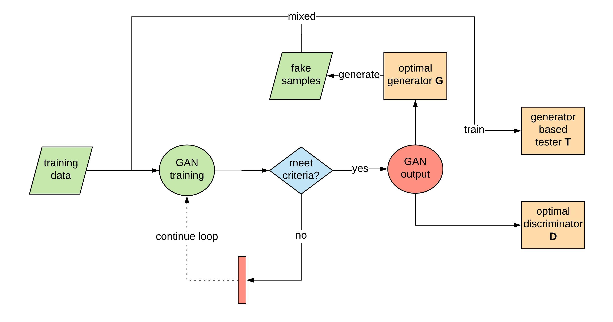
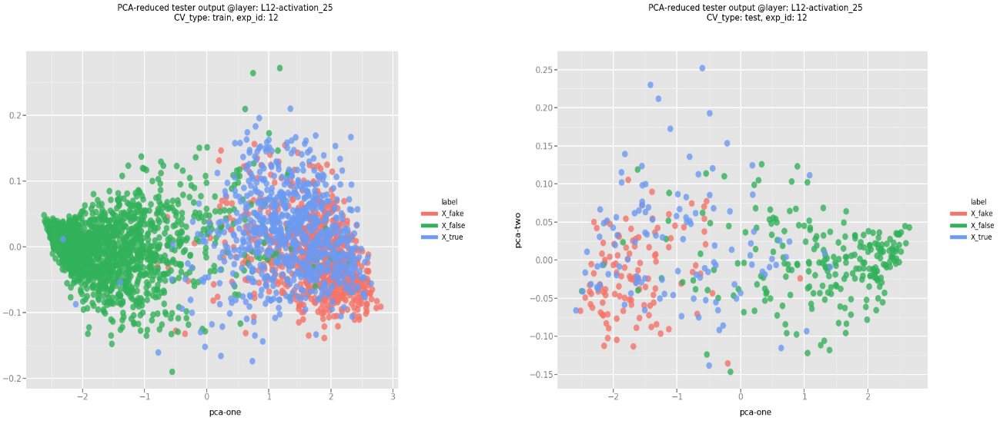

# enhanceGAN

*Strayn Wang*

### Introduction

The enhanceGAN generates data to improve classifier performance. It evaluates the generated samples quality by testing a tester (classifier trained on real fake combined dataset) on the validation dataset. The workflow is shown below:  


At the end of GAN game, one will have an optimal generator $G^*$ that can be used to generate meaningful samples, an optimal tester $T^*$ and an optimal discriminator $D^*$ that is expected to be more powerful than same thing trained on solely real data if the genereated samples make sense.

##### Advantages of enhanceGAN tool:
1. It provides nice training features such as balance control, categorical weights control, stochastic sample generation etc., which facilate GAN training and avoid collapses.  
2. It provides an excel interface for hyper-parameters exploration, which makes it easy.  
3. It monitors many metrics like gradients, losses, class-wise accuracies etc. which faciliates further research. It provides easy function to summarize validation/testing results, and use tSNE/PCA plots to analyze GAN generated samples.    
4. It is flexible at customizing different data and model design (not necessarily CDK, they can be drug, images or any other data encoded in one-hot manner).  


### Setup environment
Python3 and the following packages are required, to install the packages on Linux or MacOS:   
1. download the enhanceGAN package
    ```
    git clone https://github.com/nyartsgnaw/enhanceGAN
    ```
2. run with super user power:
    ```
    sudo -i;
    ```
3. install python packages by running the following command in your terminal
    ```
    pip install datetime;
    pip install re;
    pip install pandas;
    pip install numpy;
    pip install keras;
    pip install tensorflow;
    pip install multiprocessing;
    pip install ggplot;
    ```
4. exit super user by running following command in your terminal
    ```
    exit;
    ```

### Example usage
Simply run ```python ~/enhanceGAN/run.py```  once you've finished the above setups, and then you will have the output file in ```~/enhanceGAN/logs```.

### Check GAN outputs
- Logs for GAN discriminators and generators are saved at ```~/enhanceGAN/logs/test_history/GAN/```, the optimal trained models are saved at ```~/enhanceGAN/logs/trained_models/GAN/```.  

- Logs for initializing (pre-training) discriminators and generators are saved at ```~/enhanceGAN/logs/init/```, and the optimal initialized models are saved at ```~/enhanceGAN/logs/trained_models/init/```.  

- Logs for testers that are trained on generated-sample-mixed datasets are saved at ```~/enhanceGAN/logs/test_history/tester/```, the optimal trained models are saved at ```~/enhanceGAN/logs/trained_models/tester/```.  

- Logs for fake samples used in training testers are saved to ```~/enhanceGAN/logs/fakeData/```.  

- Logs for prediction values evaluating testers are saved to ```~/enhanceGAN/logs/predictions/```.  

**********************************

### Setup an experiment

enhanceGAN provides an excel interface to setup experiments in ```~/enhanceGAN/exp_logs.xlsx```. 
Each experiment includes the following process: 1)pre-training discriminator/generator; 2)GAN process; 3)training generated samples based generator.

- exp_id: identifies an experiment. It will be used as log records and output_model file names, therefore it should be unique.
- trainData_id: chooses a training dataset. ```trainData_id``` looks for an address specified in ```~/enhanceGAN/experiments/menu_trainData.csv```.
- valData_id: choose a validation dataset. ```valData_id``` looks for an address specified in ```~/enhanceGAN/experiments/menu_valData.csv```.
- model_id: chooses a model structure set (e.g. Convolutional Neural Network, Long Short Term Network etc.). Each of the model structure defines the model structures of GAN generator $G$, GAN discriminator $D$ and tester classifier $T$ in ```./experiments/models/{model_id}.csv```, 

- setup_id: chooses a hyper-parameter setup for the GAN optimization process. ```setup_id``` is specified in ```~/enhanceGAN/experiments/menu_setup.csv```, parameters in this files are explained below:  
    1. setup_id: a unique number specifies a setup set.
    2. batch_size: how many samples in each mini-batch.
    3. val_prop: how much proportion of training data is used as in-training validation, it could be set to 0.
    4. noise_ratio: the ratio of noise label size and positive label size, default as 1.
    5. n_epoch: number of maximal epochs for GAN training.
    6. patient: parameter used for tracking GAN training, e.g. how many epoch to track for gradients,losses,equilibriums.
    7. n_epoch_init_D: number of maximal epochs for GAM discriminator initialization (pre-training).
    8. n_epoch_init_G: number of maximal epochs for GAM generator initialization (pre-training).
    9. n_epoch_T: number of maximal epochs for tester classifier.
    10. opt_D: optimizer for GAN discriminator, it could be one of ```'sgd'```, ```'rmsprop'``` and ```'adam'```, you can customize your own optimizer by setting in ```~/enhanceGAN/run.py```.
    11. opt_G: optimizer for GAN generator, it could be one of ```'sgd'```, ```'rmsprop'``` and ```'adam'```, you can customize your own optimizer by setting in ```~/enhanceGAN/run.py```.
    12. lr_D: learning rate of discriminator.
    13. lr_G: learning rate of generator.
    14. loss_D: loss function for discriminator.
    15. loss_G: loss function for generator.
    16. X_encode: the way incoming X is encoded. enhanceGAN accepts both ```'onehot'``` encoding and ```'integer'``` encoding, details in ```Methods``` section.
    17. Y_encode: the way incoming Y is encoded. it could be either ```'integer'``` encoding or ```'onesided'``` encoding, details in ```Methods``` section.
    18. is_generating_stochastic: whether to generate samples in a stochastic manner, details in ```Methods``` section.
    19. is_categorical_weight_control: whether to add categorical weights to control the GAN training process, details in ```Methods``` section.
    20. is_monitored: whether to display (print out) the metrics within GAN training, if not, the metrics would still be saved to logs.
    21. is_tester: whether to use a tester to evaluate GAN training throughout the process, if False, Nash Equilibrium metric will be monitored.
    22. is_early_stopping: whether to implement early stopping criteria specified in ```~/enhanceGAN/lib/utils/train_GAN.py```.

### Starting the program (following code are execuded in terminal under ~/enhanceGAN/)

##### Preprocess data
1. Preprocess data to make sure column names and data types in the entries are the same as the current files ```~/enhanceGAN/data/  /df_test.csv``` and ```~/enhanceGAN/data/CDK/df_train.csv```. The following step will initialize cross validation datasets based on these dataset.  

2. Initialize training/validation/testing datasets and assign ID to menu in: ```~/enhanceGAN/experiments/*.csv```:
```python ./data/lib/init_cv_data.py;```. 

For customizing own dataset, code in ```~/enhanceGAN/data/``` should be adpated to suit the real data, but ```~/enhanceGAN/data/lib/prepare_data.py``` should be fine unless the shape of the given encoding of customized data changes to something other than "one-hot encoding".

##### Run GAN process
3. After setup experiments parameters, start the GAN process by:
```python ./run.py;```.  
 
 
##### Summarize results 

3. Initialize tests setup file:
```python ./analysis/compare/testGAN/init_exp_logs.py```

4. Test generated-sample based testers (classifier) on testing dataset specified in ```~/enhanceGAN/analysis/compare/GAN_test/exp_logs_TG0.xlsx```:  
    ```python ./analysis/compare/testGAN/run_testGAN.py -f exp_logs_TG0.xlsx;```  

5. Test discriminators on testing dataset specified in ```~/enhanceGAN/analysis/compare/GAN_test/exp_logs_TD2.xlsx```:  
    ```python ./analysis/compare/testGAN/run_testGAN.py -f exp_logs_TD2.xlsx;```  

6. Test blank testers on testing dataset specified in ```~/enhanceGAN/analysis/compare/GAN_test/exp_logs_TB0.xlsx```:  
    ```python ./analysis/compare/testGAN/run_testGAN.py -f exp_logs_TD2.xlsx;``` 

After which, results of them will be automatically filled into these test setup files. 

7. Find the best experiments (identified by exp_id) on one trainData_id regarding AUC on validation dataset (optional):
 ```python ./analysis/compare/find_best_setup.py; ``` 
 The outputs will be found at ```~/enhanceGAN/analysis/compare/output/```.

8. Get a summary table that compares training/validation/testing/blank testers and validation accuracies, rho of pearson correlation, pValue of pearson correlation, AUC on the testing dataset, GAN training class-wise accuracies etc.:  
```python ./analysis/compare/get_compare_df.py;```  
The output will be found at ```~/enhanceGAN/analysis/compare/output/df_compare.xlsx```

9. Reduce dimension of output layers of a blank tester by PCA and tSNE, resulted plots are saved to ```~/enhanceGAN/analysis/reduce_dim/plots/```:
    ```python ~/enhanceGAN/analysis/reduce_dim/reduce_dim.py;```    



**********************************

### Customize your own data & model structures
To customize your own data you can simply do the following steps:
1. Put your training datasets in ```~/enhanceGAN/data/trainData/```, providing and unique data id ```trainData_id``` for each training set and an corresponding data address ```addr``` in ```~/enhanceGAN/experiments/menu_trainData.csv```. If you don't modify ```menu_trainData.csv```, you will have to modify ```~/enhanceGAN/run.py```. Do the same for validation datasets and save them into ```~/enhanceGAN/data/valData/```, and testing datasets into ```~/enhanceGAN/data/testData/```;   
2. Tune code in ```~/enhanceGAN/data/lib/prepare_data.py``` to read your data (data are saved to csv files as default, however you can make it any format as long as your ```prepare_data``` class defined in this file can read them);  
3. Change your data structures in ```./experiments/models/{model_id}.csv```, and then you should have put your own data to enhanceGAN. 


